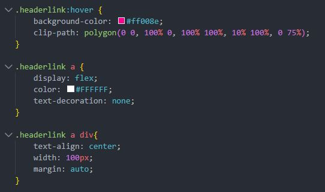
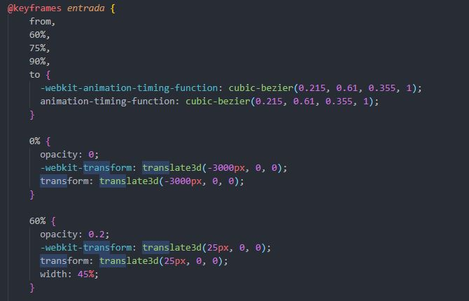
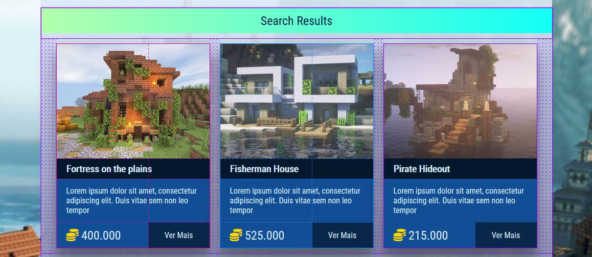
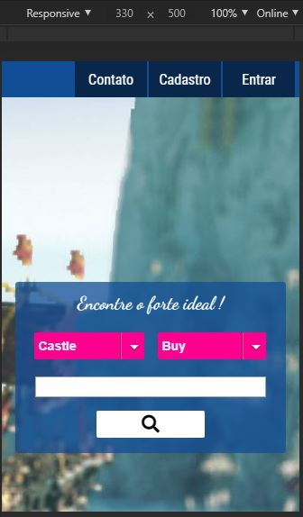
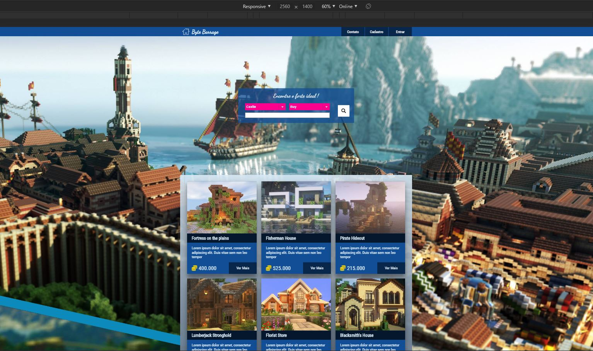

# Byte Barrage

Este é o repositório do projeto final de da disciplina Linguagem de Marcação, fiz esse projeto na faculdade em 2018, 
esse projeto foi feito utilizando HTML5 e CSS3 sem o auxílio de frameworks.

## Características

* Possúi 5 páginas, a página index , página de pesquisa, página de contato, página de cadastro, e página de login.
cada página possúi sua folha de estilo própria e todas as páginas utilizam a folha de estilo main.

* Faz utilização de seletores na estilização com CSS: ID, class, cascata e herança, pseudo-classes e pseudo-elementos.

  
  
* Faz uso de animações e transitions e transform.

  

* Posicionamento de elementos utilizando conceito de layout em CSS: grid, flexbox,float, position.

  

* Possúi design responsivel desde dispositivos mobile com tela pequena até disposítivos em 4K.

  * Mobile
  
  
  
  * 4K
  
  
  

## Requisitos Mínimos

1. Navegador com suporte a HTML5 e CSS3.
2. Dispositivo com largura de tela miníma de 350px e máxima de 2560px.
